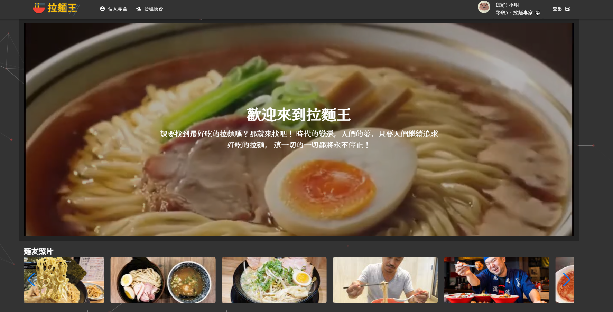
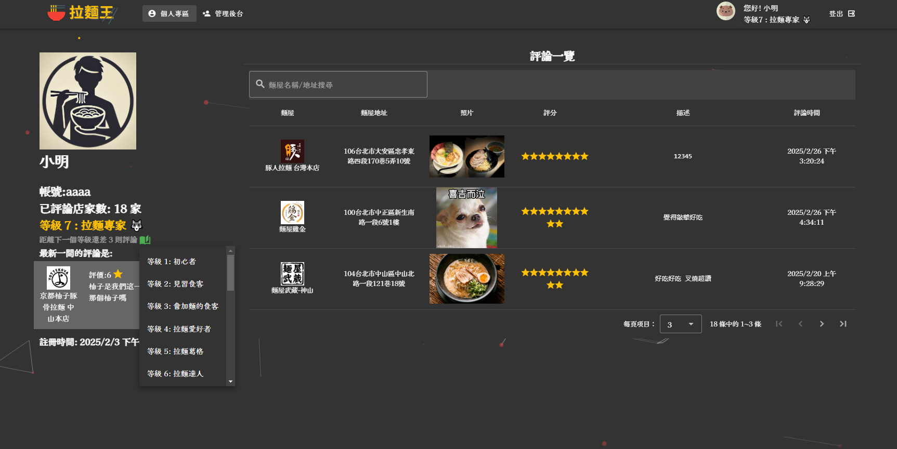

# 拉麵王 🍜

## 專案簡介

**拉麵王** 是一個會員系統，讓使用者記錄自己吃過的拉麵店，避免重複造訪，並分享評論與心得。

### 主題發想

常常跟朋友出去吃美食，其中拉麵店是最常去的。台灣有超過一千間拉麵店，想要吃遍各種拉麵但有時候會忘記自己吃過哪家。因此，這個專案誕生了，提供一個方便的工具來記錄拉麵足跡。

---

## 技術架構 🛠️

**本專案使用了以下技術與套件：**

- **前端技術：** Vue 3, Vuetify, Vue Router, Pinia, VITE, tsparticles, swiper, sweetalert2
- **後端技術：** Node.js, Express, mongoose, passport, bcrypt, jsonwebtoken, validator, axios, cloudinary
- **專案結構：** 前後端分離

---

## 功能與特色 ✨

- **會員系統**：使用者可以註冊、登入、查看個人紀錄。
- **等級系統**：根據用戶的拉麵評論累積等級。
- **拉麵評論**：使用者可留下對拉麵店的評價與心得。
- **管理後台**：管理店家內容以及使用者的評論。

---

## 截圖展示 📸

---

## 授權 📜

本專案採用 **Beerware 授權**

---

## 聯絡方式 📩

如果有任何問題，請透過 Email 或其他方式聯絡開發者。

---

🎉 **感謝使用拉麵王，快來記錄你的拉麵之旅吧！** 🍜🔥
